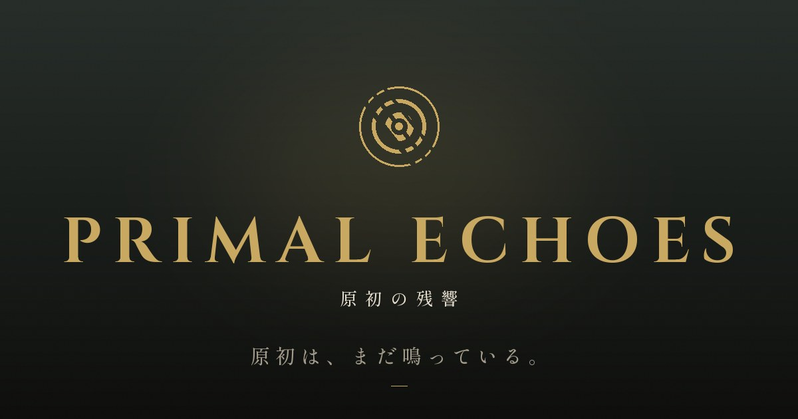

<p align="center"></p>

# PRIMAL ECHOES

**原初は、まだ鳴っている。** — 痕跡を読み、原初の獣と向き合う、ブラウザの 3D 狩猟アクション。

**▶ 遊ぶ: https://jiantailanglin266-rgb.github.io/primal-echoes/** （無料・インストール不要・日本語 / English）

海図の外の大陸ヴァルディア。生き物は体内に「残響（エコー）」を宿し、その残響を最も濃く宿す巨大な獣「原獣」がいる。狩人は前哨から谷へ出て、足跡と食い跡を読み、獣と向き合い、素材を持ち帰って刃を鍛える。完全オリジナル IP。既存作品からの流用はない。

## 特徴
- **観察が攻略になる**: 獣は空腹なら群れを追い、渇けば白瀬で水を飲み、疲れれば寝床で眠り、雨が来れば洞へ退く。深く傷つけば寝床へ帰る。全部、痕跡でわかる。
- **重く、短い戦闘**: 攻撃には発生・判定・硬直がある。Hit Stop、討伐のスローモーション、部位破壊と切断、怒り・疲労・転倒・気絶。
- **一つの概念でつながる世界**: 残響（エコー）がタイトル・獣・素材・鍛冶を貫く。UI・文章・音・ロゴまで同じ声で作られている（`docs/brand/`）。
- **端末に合わせて動く**: GPU と実測 FPS から画質を自動で決める。ゲームパッド対応。

## 操作
| キー | 動き |
|---|---|
| W A S D | 歩く |
| Shift | 駆ける |
| Space | 躱す |
| J / K | 斬る / 振り下ろす（長押しで溜め） |
| Tab | 獣を見据える |
| E | 剥ぐ・崩す |
| H | 薬を飲む |
| Esc | 静止 |

ゲームパッドは標準配置。メニューは十字キーと A / B。

## 動作環境
- WebGL 2 が動くブラウザの最新版（Chrome / Edge / Firefox / Safari）
- 推奨: 独立 GPU または Apple M 系、1080p。内蔵 GPU では画質「中」以下が自動で選ばれる
- モバイルは画質「低」で起動する（操作系はキーボード前提のため、現状は閲覧向け）
- URL パラメータ: `?quality=low|mid|high`（画質固定）、`?landing=0`（ランディングを飛ばしてタイトルへ）、`?skipIntro=1`、`?photo=1`（撮影）、`?trailer=1`（トレーラー）、`?hud=1`（HUD 確認）、`?debug=1`（開発）

## 技術構成
TypeScript (strict) / Three.js / Vite / Vitest / Web Audio。シミュレーション層（`src/core`）は描画ライブラリに依存しない。

| 層 | 内容 | 詳細 |
|---|---|---|
| core | 戦闘（攻撃の三相、部位、怯み・転倒・気絶）、生態 AI（空腹・渇き・疲労・雨・負傷）、狩り、素材、鍛冶、保存 | [docs/ARCHITECTURE.md](docs/ARCHITECTURE.md) |
| presentation | WebGL（CSM、大気散乱の空と IBL、地形ブレンド、植生、ポストプロセス、カメラと手応え、画質自動調整） | [docs/CG_UPGRADE.md](docs/CG_UPGRADE.md) |
| ui | 画面遷移、HUD、ランディング、i18n（`src/i18n/ja.json` / `en.json`） | [docs/brand/](docs/brand/) |
| audio | 合成音の効果音、層で遷移する BGM、エリア別環境音 | [docs/brand/SOUND_DIRECTION.md](docs/brand/SOUND_DIRECTION.md) |
| tools | 撮影モード（`?photo=1`）、トレーラーのカメラパス（`?trailer=1`） | [docs/brand/TRAILER_STORYBOARD.md](docs/brand/TRAILER_STORYBOARD.md) |

### 開発
```bash
npm install
npm run dev       # http://localhost:5173
npm run check     # 型検査 + テスト
npm run build     # dist/（GitHub Pages へは main への push で自動デプロイ）
```

デバッグ: `?debug=1` でオーバーレイ（FPS・品質・描画コール・メモリ）、stats.js、描画パネル、当たり判定表示。F1 回復 / F2 無限気力 / F3 討伐 / F4 獣を戻す / F5 AI 停止 / F6 怒り / F7 獣の背後へ / F9 狩りを退く。`?bot=1` で通しプレイ検証ボット。テキストを直すときは `src/i18n/*.json` を編集し、`node scripts/copy-deck.mjs` で対訳表を更新する。

### アセットの配置（任意）
外部アセットが無くても手続き生成と合成音で動く。置くと自動で差し替わる（すべて CC0 など再配布可能なものを使い、下の出典欄に記す）。

| 置く場所 | 内容 |
|---|---|
| `public/assets/hdri/environment.hdr` | 等距円筒 HDRI（IBL と背景） |
| `public/assets/models/{ranger,valgaron}.glb` | glTF（Draco / KTX2 可）。クリップ名は `CharacterRig.ts` の対応表 |
| `public/assets/audio/bgm/{bed,pulse,strings,drums}.ogg` | 同テンポ（BPM 72）のループ 4 本 |
| `public/assets/audio/amb/{wind,insects,water,rain,cave}.ogg` | 環境音ループ |
| `public/assets/audio/sfx/*.ogg` | 効果音（`src/audio/Sfx.ts` の `sample` 名） |

## ドキュメント
| ファイル | 内容 |
|---|---|
| [docs/brand/BRAND_BIBLE.md](docs/brand/BRAND_BIBLE.md) | 世界観・命名規約・トーン＆マナー・5 原則（すべての判断の拠り所） |
| [docs/brand/VISUAL_IDENTITY.md](docs/brand/VISUAL_IDENTITY.md) / [styleguide.html](docs/brand/styleguide.html) | 色・書体・ロゴ・アイコン・グラフィック言語 |
| [docs/brand/COPY_DECK.md](docs/brand/COPY_DECK.md) | ゲーム内全テキストの対訳 |
| [docs/brand/SOUND_DIRECTION.md](docs/brand/SOUND_DIRECTION.md) | 音の方向性と素材の置き場 |
| [docs/brand/TRAILER_STORYBOARD.md](docs/brand/TRAILER_STORYBOARD.md) | 60 秒トレーラーの絵コンテ |
| [docs/brand/PROGRESS.md](docs/brand/PROGRESS.md) | ブランディングの各フェーズの成果物と判断事項 |
| [docs/presskit/](docs/presskit/) | プレスキット |
| [docs/GAME_DESIGN.md](docs/GAME_DESIGN.md) / [docs/ROADMAP.md](docs/ROADMAP.md) / [docs/BALANCE.md](docs/BALANCE.md) / [docs/ASSET_TODO.md](docs/ASSET_TODO.md) | 設計・計画・調整値・アセット一覧 |

## クレジット
- 制作: Hollow Signal（仮） / 設計・実装: Kenta
- 書体: Cinzel（Natanael Gama）、Shippori Mincho（FONTDASU）、Cormorant Garamond（Christian Thalmann）— SIL Open Font License
- 技術: Three.js（MIT）ほか `package.json` 記載のライブラリ
- 音: Web Audio の合成音。素材音源を使う場合はここに出典を記す

## ライセンス
コード: MIT。世界観・名称・ロゴ・文章・画像（`public/assets/brand/`、`docs/brand/`、`src/i18n/`）は © Hollow Signal / Kenta。無断転載不可。
